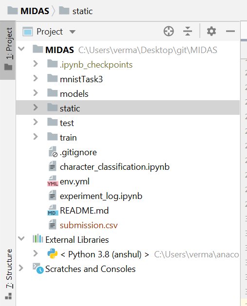

# MIDAS - coding problem
 
## TASK 2

The repository is an attempt to solve the challenge given by MIDAS for their internship program.

All the code is in `character_classification.ipynb` and some of the other items which were attempted is mentioned in `experiment_log.ipynb`

### Pre-requisits

1. Modules needed to run the notebook are all mentioned in `env.yml` file. I use Anaconda and you can create the environment I used for this project using 
    ```batch
        conda env create -f environment.yml
    ```

2. The notebook assumes that the data-folders for the task-2, subtask-1 and 2 are present in the location
    
3. The network and models are fairly small and thus have been pushed to the repository.

### Additional Info
 
 - The static folder contains images which are used in the notebook.

 - predict for class MIDAS-CNN is not written atm because it was not need but it will be useful for prediction and should be straight forward to write.
  